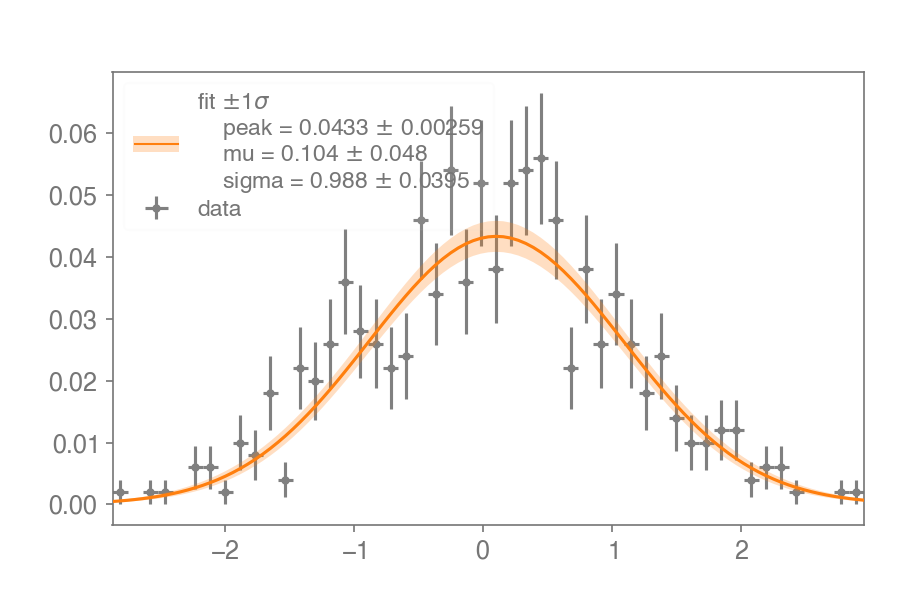

## Yet another histogram


### Overview

Histogram objects (1D and 2D) with easy manipulations (`numpy`), plotting (`matplotlib`), and fitting (`scipy`/`iminuit`).

```python
import numpy as np
from yahist import Hist1D

h = (Hist1D(np.random.normal(0, 1, 1000), bins=100, label="data")
     .rebin(2)
     .normalize()
    )
h.plot(show_errors=True, color="k")
h.fit("peak * np.exp(-(x-mu)**2 / (2*sigma**2))")
```


Much more functionality is showcased in the example notebook below.

### Examples

[](https://mybinder.org/v2/gh/aminnj/yahist/master?filepath=examples%2Fbasic.ipynb)

(static [nbviewer](https://nbviewer.jupyter.org/url/github.com/aminnj/yahist/blob/master/examples/basic.ipynb) if Binder is slow)

### Installation

```bash
pip install yahist
```
or to install the latest version directly from github
```bash
pip install git+git://github.com/aminnj/yahist.git#egg=yahist -U
```
