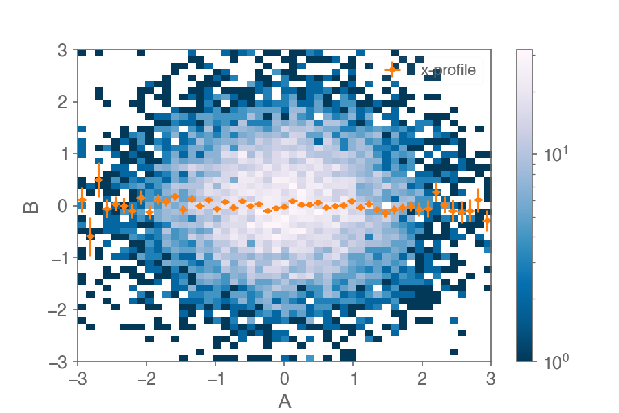

## Yet another histogram


[](https://aminnj.github.io/yahist/)
[](https://mybinder.org/v2/gh/aminnj/yahist/master?filepath=examples%2Fbasic.ipynb)

```bash
pip install yahist
```

### Examples ([API docs](https://aminnj.github.io/yahist/))
[](https://mybinder.org/v2/gh/aminnj/yahist/master?filepath=examples%2Fbasic.ipynb)
(static [nbviewer](https://nbviewer.jupyter.org/url/github.com/aminnj/yahist/blob/master/examples/basic.ipynb) if Binder is slow)


### Overview

Histogram objects (1D and 2D) with easy manipulations (`numpy`), plotting (`matplotlib`), and fitting (`scipy`/`iminuit`).

```python
import numpy as np
from yahist import Hist1D

v = np.random.normal(0, 1, 1000)
h = Hist1D(v, bins=100, label="data").rebin(2).normalize()
h.plot(errors=True, color="k", ms=3)
h.fit("peak * np.exp(-(x-mu)**2 / (2*sigma**2))")
```


```python
import pandas as pd

df = pd.DataFrame(np.random.normal(0, 1, size=(10000, 2)), columns=["A", "B"])

h = Hist2D(df, bins="30,-3,3", threads=4)
h.plot(logz=True, cmap="cividis")
h.profile("x").plot(errors=True, color="r", marker=".", label="x-profile")
```


Much more functionality is showcased in the example notebook, including
* fitting (chi2 or likelihood)
* interactive plots (via `bokeh`)
* datetime inputs/axes
* rebinning/subsetting
* profiling/projecting 2D histograms
* acceleration of 1D/2D histogram creation with [boost-histogram](https://github.com/scikit-hep/boost-histogram)
* using the histogram as a lookup function
* serialization to/from json

...and more.


